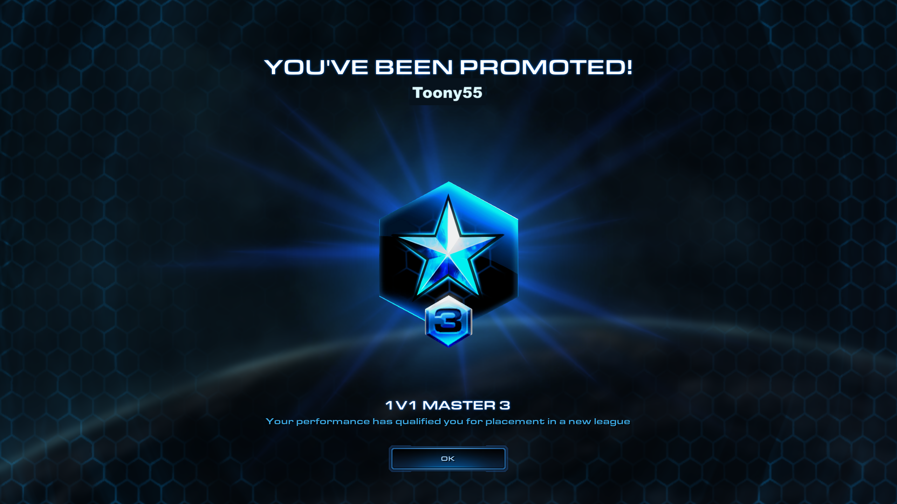

# H611 - FinalProject (IUPUI - Applied Data Science)

# FOR THE TA
I was planning on writing a write up here and then learning how to make animated videos the same way as 3Blue1Brown, all in python. 
However.... That was over ambitious (but still very possible! - just couldn't fit it in the time). I will be moving back to HackMD for the first and I suppose final submission - but hope this explains briefly why i picked GitHub for now but I didn't want to have to send you another URL. 


# Backpropagation by Alex Toon

**"From bronze league to grandmaster, all it takes is back-propagation."**


## Mission 0 - What game are we playing?

Imagine you're playing a competitive game for the 67th time that day. Every attempt you change something, use a new or different race/species, try a new build strategy, use different units. You want to optimize your build and strategy to do the most damage possible or attack more quickly and hopefully win the game.

Don't you just wish there was a way to learn from all those games, analyze what worked and what didn't, and improve your strategy over time? Maybe even have a computer help you figure it out?

In this paper, I aim to explain back-propagation through the lens of a video game Real time strategy (RTS) optimization. For those non gamers, imagine a very intense, live game of chess. Back-propagation is the algorithm that allows neural networks to learn from their mistakes and improve over time. 

Maybe this could close our skill gap?


**What is Starcraft 2**

The literal game I will focus on is Starcraft II, a popular RTS game released in 2010, where players play as one of three races/species, gather resources, build bases, and command armies to defeat their opponents. The goal is to optimize your build order and strategy to maximize your chances of winning. 

My goal in this write up is to make back-propagation understandable using a small Starcraft 2 example, not to explain every detail of Starcraft or deep learning.

**Why Starcraft 2?**

The key points are:

- **It is real time** - meaning you have to make decisions quickly and adapt to changing situations. There is no turn based system. 
- **Partially observable** - you can't see everything your opponent is doing, so you have to make educated guesses. This is called the "fog of war".
- **Long horizon strategy** - decisions made early in the game can have a significant impact on the outcome and games can last up to around 40 minutes and longer. 
- **Complex interactions** - there are many different units, buildings, and technologies that interact in complex ways. Imagine trying to learn chess with 100 different piece types, each with unique abilities and combinations like our other favourite game, rock paper scissors.

In this write up I am going to ignore most of that complexity and focus on **"back-propagation"** . I will use a simplified StarCraft 2 example so we can all see how the math actually works. 

For an example of how advanced this can get, "AlphaStar" was a real example of an AI in 2018 that mastered Starcraft II using deep reinforcement learning and back-propagation. It learned from millions of games, improving its strategies and decision-making over time and inspired this write up. 
I personally never got to play against it, but i guarantee it would have been a tough match and i got to grandmaster rank (Top 4% of players) in SC2 back in the day.

I hope you enjoy this write up and learn something new about back-propagation and neural networks!

**Roadmap**

The papers structure is as follows:

- Mission 1 Introduces the network structure.
- Mission 2 Covers the forward pass and cost function.
- Mission 3 Explains the chain rule and error measurement.
- Mission 4 Discusses weights and pseudo code.
- Mission 5 Ties everything together with a recap and real-world applications.


## Mission 1 - The Network as a build order

To make back-propagation understandable, we will focus on a small problem from a Starcraft 2 match. 

A full game has a LOT of details, instead we will focus on just a few high level concepts:

- Numbers of workers (Resource collection rate)
- Army supply (how many units you can have / build up to without increasing your supply cap)
- total unit (army) value currently built
- Number of structures (And their total value)
- A simple tech score based on investment

Bundles together in a vector, it would look like:

$$
\mathbf{X} =
\begin{bmatrix}
\text{workers} \\
\text{army supply} \\
\text{total unit value} \\
\text{number of structures} \\
\text{tech score} \\
\end{bmatrix}
$$

Our goal is for a neural network to take this $\mathbf{X}$ input (the vector) and output a single number $\hat{y}$, which represents the predicted probability of winning the game from this snapshot / game state.

### Network Structure

We will use a very small neural network with:

- **Input Layer**: 5 neurons (one for each feature in $\mathbf{X}$)
- **Hidden Layer**: 3 neurons (will be explained later)
- **Output Layer**: 1 neuron (for the win probability $\hat{y}$)

You can visualise the network like this:


Each arrow has a **weight** associated with it, which determines the strength of the connection between neurons. Another way to think about this is how strongly one neuron influences the next. 

Each neuron (each circle) also has a **bias** term, which allows the neuron to shift its activation function up or down.

Inside each neuron we:

- Take a weighted sum of the inputs ($\mathbf{X}$ for the input layer, or activations from the previous layer for hidden/output layers)
- Add the bias (to the neuron/circles)
- Pass the result through an activation function

We will introduce the exact equations in mission 2. For now it's enough to know that the network is a stack of simple layers/computations that turn a game state $\mathbf{X}$ into a win probability $\hat{y}$.

### Mapping to Starcraft 2

| Symbol / object | Neural Network Concept | Starcraft 2 Concept |
|-----------------|-----------------------|---------------------|
| $\mathbf{X}$ | Input Vector | Game State Features (workers, army supply, etc.) |
| $\hat{y}$ | Output | Predicted Win Probability |
| $w^{(1)}. W^{(2)}$ | Weights | Influence of one feature on the next layer |
| $b^{(1)}. b^{(2)}$ | Biases | Adjustment to neuron activation |
| $z^{(1)}. z^{(2)}$ | Weighted Sum + Bias | Pre-activation value in neurons |
| ${a}^{(1)}$ | Hidden layer | Learned internal concepts |
| $\hat{y}$ | Output layer | Final win prediction |

In mission 2 we will see how the forward pass works to get from $\mathbf{X}$ to $\hat{y}$.


## Mission 2 - The battle: Forward pass and cost

Now that we have our really small Starcraft 2 network, the next question you may be asking is: 

"What does it actually do with a single game state?" 
"What happens inside the network?"
"How does it make a prediction?"

All good questions! The answer lies in the **forward pass**.

In this mission we will follow one position through the network **forwards** and see how it produces a prediction. Afterwards we will then define a **cost function** to measure how good or bad that prediction was.


### From game state to prediction - The forward pass

If we take a single snapshot of a game and turn it into our feature vector, just like before we have:

$$
\mathbf{X} =
\begin{bmatrix}
\text{workers} \\
\text{army supply} \\
\text{total unit value} \\
\text{number of structures} \\
\text{tech score} \\
\end{bmatrix}
$$

Our network processes this input layer by layer

**Input Layer to Hidden Layer**:

First we combine the inputs using a weight matrix $W^{(1)}$ and bias vector $b^{(1)}$:

$$
\mathbf{z}^{(1)} = W^{(1)}  \mathbf{X} + b^{(1)}
$$

Each component of $\mathbf{z}^{(1)}$ is kind of a "raw score" for a hidden neuron. All of which is based on the current game state. 

We then apply a non-linear activation function $\alpha$. 

$$ \mathbf{a}^{(1)} = \alpha(\mathbf{z}^{(1)}) $$

You can think of $\mathbf{a}^{(1)}$ as the network's learned internal representation of the game state.

- "I'm ahead in economy"
- "I have a strong army"
- "My tech is advanced"

The network will *learn* what these mean. 

**Hidden Layer to Output Layer**:
Next, we take the activations from the hidden layer and pass them to the output layer using another weight matrix $W^{(2)}$ and bias $b^{(2)}$:

$$
z^{(2)} = W^{(2)} \mathbf{a}^{(1)} + b^{(2)}
$$

and then pass this through a final activation function (often a sigmoid for probabilities):

$$\hat{y} = \sigma(z^{(2)})$$

This $\hat{y}$ is our predicted probability of winning the game from the current state $\mathbf{X}$.

a value like $\hat{y} = 0.75$ means the network thinks there's a 75% chance of winning from this position.

### Measuring prediction quality - The cost function

The forward pass gives us a prediction $\hat{y}$, but how do we know if it's any good? - Also once the game finishes we also know the actual outcome $y$ (1 for win, 0 for loss).

To actually train a network we need to turn the difference between prediction ($\hat{y}$) and actual outcome ($y$) into a number we can minimize (the cost). This is where the **cost function** comes in.

$$
C(\hat{y}, y) = \frac{1}{2} (\hat{y} - y)^2
$$

To make this intuitive: 

- If the network predicts $\hat{y} = 0.9$ but actually loses ($y=0$), the cost is high: $C(0.9, 0) = 0.405$.
- If it predicts $\hat{y} = 0.6$ and wins ($y=1$), the cost is lower: $C(0.6, 1) = 0.08$.
- If it predicts perfectly $\hat{y} = 1$ and wins ($y=1$), the cost is zero: $C(1, 1) = 0$.

Over many games from replays, we average the cost across all predictions to get an overall measure of how well the network is doing.

### Why does this matter?

At this stage we have:

- A **forward pass** that turns a game state $\mathbf{X}$ into a win probability $\hat{y}$.
- A **cost function** that measures how far off that prediction is from the actual outcome $y$.

In mission 3, we will use the chain rule (from calculus) to figure out how to adjust the weights and biases in the network to reduce this cost. **This is the essence of back-propagation** - pushing the error backwards through the network to learn from mistakes and improve future predictions.

This is how we turn a simple Starcraft 2 win predictor into a learning system that can optimize its strategy over time.

## Mission 3 - Replay Analysis: chain rule & errors

So far we can:

- Take a Starcraft 2 position $\mathbf{X}$ and run it forward to get a prediction $\hat{y}$.
- Compare $\hat{y}$ to the actual outcome $y$ using a cost function $C(\hat{y}, y)$.

Combined , this tells us how well our network is doing at predicting wins from game states.

Now to actually **learn** from its mistakes, we need to figure out how to adjust the weights and biases in the network to reduce this cost. This is where the **chain rule** from calculus comes in.

### The chain rule recap - Breaking down the error

If $C$ depends on $z$ and $z$ depends on $w$, then the chain rule tells us:

$$
\frac{dC}{dw} = \frac{dC}{dz} \frac{dz}{dw}
$$

In a neural net, each weight $w$ influences the cost $C$ through multiple layers of computations. The chain rule lets us break down this influence step by step.

### Error at the output layer

At the output layer, we define the error signal $\delta^{(2)}$ as:

$$
\delta^{(2)} = \frac{\partial C}{\partial z^{(2)}}
$$

Using the chain rule, we can express this as:

$$
\delta^{(2)} = \frac{\partial C}{\partial \hat{y}} \cdot \frac{\partial \hat{y}}{\partial z^{(2)}}
$$

$\delta^{(2)}$ tells us how much the output neuron contributed to the overall cost. It combines:
- The sensitivity of the cost to the output prediction ($\frac{\partial C}{\partial \hat{y}}$)
- The sensitivity of the output prediction to the pre-activation value ($\frac{\partial \hat{y}}{\partial z^{(2)}}$)
  
This error signal $\delta^{(2)}$ is crucial because it tells us how to adjust the weights and biases leading into the output layer to reduce the cost.

### Error at the hidden layer

The hidden layer does not see the cost $C$ directly, but it influences it through the output layer. We define the error signal at the hidden layer $\delta^{(1)}$ as:

$$
\delta^{(1)} = \frac{\partial C}{\partial z^{(1)}}
$$

In words, we take the output error $\delta^{(2)}$ and send it/'propagate it' backwards through the weights connecting the hidden layer to the output layer. Using the chain rule, we get:

$$
\delta^{(1)} = (W^{(2)})^T \delta^{(2)} \cdot \frac{\partial a^{(1)}}{\partial z^{(1)}}
$$

### What is all this used for?
Now we know the error signals at each layer ($delta^{(2)}$ and $\delta^{(1)}$), In Mission 4 we can use these to compute the gradients of the cost with respect to each weight and bias in the network.

## Mission 4 - Rethinking your build - Weights & psueduo code

By this stage we have:

- A **Forward Pass** that turns a game state $\mathbf{X}$ into a win probability $\hat{y}$.
- **Error signals** at each layer ($\delta^{(2)}$ and $\delta^{(1)}$) that tell us how much each neuron contributed to the overall cost.

Now in this mission we turn those error signals into gradients and then into a simple learning rule. 


### Gradients: How each weight affects cost

Once we know the error signals, we can compute the gradients of the cost with respect to each weight and bias in the network.

For weights in the output layer:

$$
\frac{\partial C}{\partial W^{(2)}} = \delta^{(2)} \cdot (a^{(1)})^T
$$

For weights in the hidden layer:

$$
\frac{\partial C}{\partial W^{(1)}} = \delta^{(1)} \cdot (X)^T
$$

Each gradient tells us how much changing that weight would change the overall cost.

### Gradient descent: Updating the build

To actually learn, we need to use **gradient descent** to update the weights and biases in the direction that reduces the cost.

For each weight, we update it as follows:

$$
W^{(l)} := W^{(l)} - \eta \frac{\partial C}{\partial W^{(l)}}
$$

- The gradients $\frac{\partial C}{\partial W^{(l)}}$ tell us the direction to adjust the weights to reduce cost.
- Subtracting a fraction of the gradient (scaled by the learning rate $\eta$) moves the weights in the right direction to improve predictions and lower the cost.

In starcraft 2 terms, this is like adjusting your build order and strategy based on what you learned from previous games. If a certain approach led to a loss, you tweak your strategy slightly to avoid making the same mistake again.

### Back-propagation as a training loop (pseudo code)

Putting it all together, the back-propagation algorithm can be summarized in the following pseudo code:


```
for each game replay in training set:
    X, y = extract_game_state_and_outcome(replay)

    # Forward pass
    a1 = alpha(W1 * X + b1)
    y_hat = sigma(W2 * a1 + b2)

    # Compute cost
    C = 0.5 * (y_hat - y)^2

    # Backward pass
    delta2 = (y_hat - y) * sigma_prime(z2)
    delta1 = (W2^T * delta2) * alpha_prime(z1)

    # Compute gradients
    dC_dW2 = delta2 * a1^T
    dC_dW1 = delta1 * X^T

    # Update weights and biases
    W2 := W2 - eta * dC_dW2
    b2 := b2 - eta * delta2
    W1 := W1 - eta * dC_dW1
    b1 := b1 - eta * delta1
```


## Mission 5 - From getting GG'ed to Grandmaster - Putting it all together

### Recap

We started with a StarCraft 2 league/ladder mindset. Play a lot of hames, make mistakes, learn from them and improve over time.

To turn that into math speak and not just gamer speak, we did the following:

- Mission 1: Defined a small neural network that takes a game state $\mathbf{X}$ and outputs a win probability $\hat{y}$.

- Mission 2: Explained the forward pass that computes $\hat{y}$ from $\mathbf{X}$ and defined a cost function $C(\hat{y}, y)$ to measure prediction quality.

- Mission 3: Used the chain rule to compute error signals at each layer of the network, telling us how much each neuron contributed to the overall cost.

- Mission 4: Turned those error signals into gradients and defined a simple learning rule to update weights and biases using gradient descent.

So all together, back-propagation allows our Starcraft 2 win predictor to learn from its mistakes. By adjusting its weights and biases based on the errors it made in previous games, it can improve its predictions over time. 


### Limitations of back-propagation in Starcraft 2

Back-propagation is a powerful algorithm, but it has limitations when applied to complex games like Starcraft 2:

- **Long-term Dependencies**: Decisions made early in the game can have long-term consequences that are difficult to capture with back-propagation alone.

- **Exploration vs Exploitation**: Back-propagation focuses on minimizing immediate prediction errors, but in a game like Starcraft 2, exploring new strategies is crucial for long-term success. 

- **Computational Complexity**: Training deep neural networks with back-propagation can be computationally intensive, especially for large-scale games like Starcraft 2.


### From our toy network to real systems - AlphaStar


Back-propagation is the engine behind the success of deep learning, enabling neural networks to learn from their mistakes and improve over time. By understanding the mechanics of back-propagation through the lens of a real-time strategy game like Starcraft II, we can appreciate how this algorithm allows AI to optimize strategies and make better decisions. 

Whether you're a gamer or a machine learning enthusiast, the principles of back-propagation are fundamental to the advancement of artificial intelligence.

Our small SC2 win predictor is tiny compared to something real, such as "AlphaStar", but the core story is the same.  Play games, measure error, push blame backwards through the network and slowly, painfully stop getting cheesed, GG'ed and eventually reach Grandmaster level play.

AlphaStar was a real example in 2018 of an AI that mastered Starcraft II using deep reinforcement learning and back-propagation. It learned from millions of games, improving its strategies and decision-making over time.



## References

- https://deepmind.google/blog/alphastar-grandmaster-level-in-starcraft-ii-using-multi-agent-reinforcement-learning/ 


## AI acknowledgement
All diagrams were created with the help of Nano-bannana AI image generator.